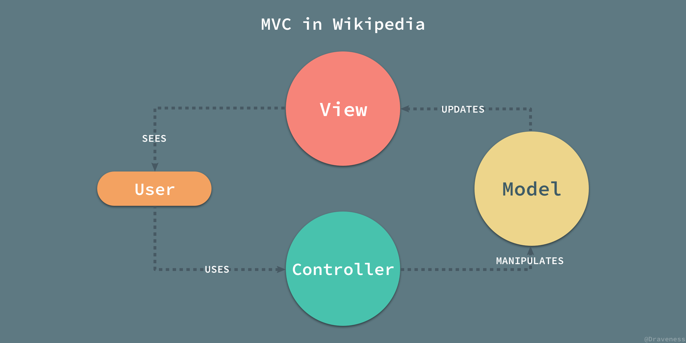
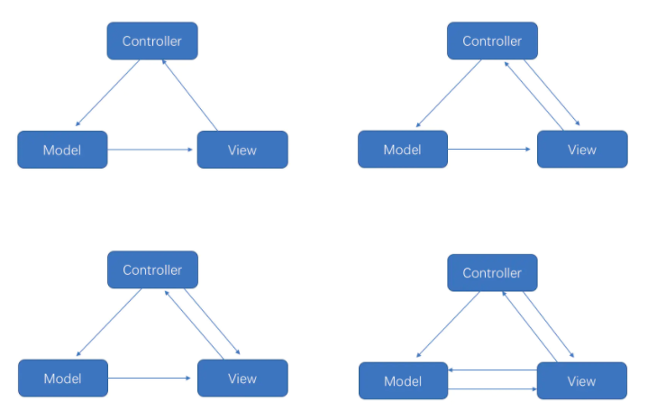
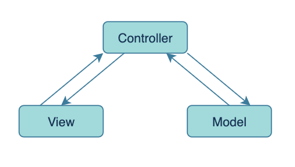

# MVC架构

## 起源与发展

MVC模式最初由Trygve Reenskaug于1979年提出并定义：

* **Model**: Model可以是一个独立的对象，也可以是一系列对象的集合体。
* **View**: View是Model中一些重要数据在视觉上的体现。
* **Controller**: Controller用于连接用户和系统，Controller接收到用户的输入时，会将其转化成合适的事件消息，并将该事件消息传递给一个或多个View。

在早期的MVC模式中，因为起初GUI框架羸弱，无法捕获处理用户事件，所以用户的操作事件由Controller捕获并处理，Controller与View之间没有直接联系。它们之间主要靠用户和Model来连接，用户使用Controller发起操作，Controller操作Model更新数据，Model更新完数据，再反映到View上以展示给用户。因此，你可能找到下图这样的结构：

再后来，随着技术的发展，View层的能力逐渐强大起来，开始能主动监听并处理一些用户事件了，而Controller则负责协助View处理事件，并且揽下了一部分介于View和Model之间的业务逻辑，在这期间MVC演化出了许多不同的分支，这些分支五花八门各不相同，但是无论怎样改变，仍然保持着Model、View、Controller三个组成部分。

在各种分支中，有一个不得不提到的特殊分支。  
随着Web开发的兴起，传统的MVC模式遇到了一个麻烦：View在用户的浏览器中显示，而Model存在于服务器中，Model无法主动通知View更新了。  
为此Web改善了MVC的事件流：当用户作出交互请求时，首先将这个交互事件交给对应的Controller，Controller根据情况完成对Model的操作，Model将操作的结果告诉Controller，再由Controller根据结果组装View返回给浏览器。

这样一来，MVC看起来就很像后来的MVP了：

## 解决的问题

MVC最重要的目的并不是规定各个模块应该如何交互和联系，**而是将原有的混乱的应用程序划分出合理的层级，把以往一团混乱的代码，按照展示层和领域层分成两个部分**。这种分离使得位于领域层中的领域对象可以不需要对展示层有任何了解，因此可以同时为不同的展示层工作，从而初步的实现了领域层与展示层的解耦。

## 角色划分

* **Model:** 用来保存程序的数据状态，比如数据存储，网络请求等。
* **View:** GUI组件构成，向用户展示Model中的数据。
* **Controller:** 连接用户和系统，响应交互，传递数据。
 
## 缺点

* MVC只是一种指导思想，因而它没有明确的规定各个模块具体应该怎样交互和联系，这使得使用MVC开发的程序其结构总是千奇百怪的，这些千奇百怪的结构也有着各自独特的优势与缺陷。
* 另外在Android中，XML作为View层功能太羸弱，许多的界面相关的代码不得不写到Activity中，而Activity同时又作为Controller协助View处理用户事件，这使得Activity的职责相当不纯粹。因此在Android中，MVC的Controller和View其实是没有分离的，形成了一种View-Model的结构。
