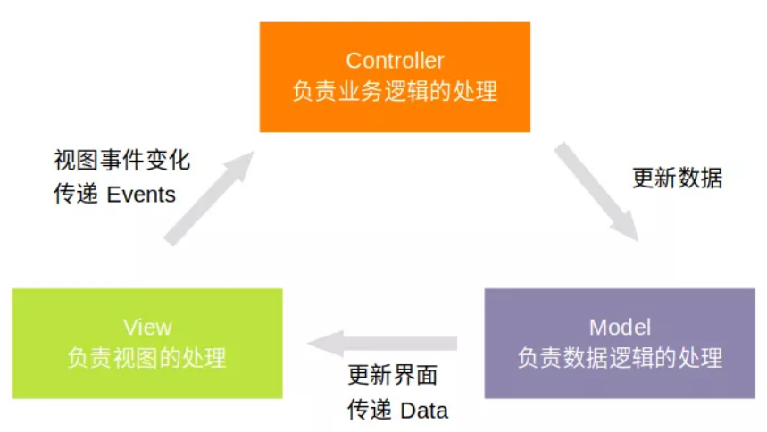

# MVC架构

## 解决的问题

* 业务逻辑和界面总算分开了

## 角色划分

* **Model:** 模型，负责数据的请求与存储
* **View:** 视图，负责界面展示
* **Controller:** 负责控制/协同View与Model

## 角色通信

View产生事件，通知Controller，Controller进行一系列的逻辑处理后，通知Model更新数据，Model更新完数据以后，将数据返回到View去更新界面。
 
## 缺点

* XML作为View层功能太弱，无法处理界面逻辑，Activity不得不担任View的部分职责，*而Activity一开始就被设计为Controller的角色(有待商榷)*，使得Android中的MVC更像是MV。
* 各角色之间还是存在耦合，尤其是Model与View之间（领域模型不应该直接用于界面）。