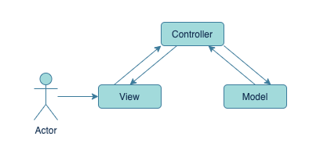
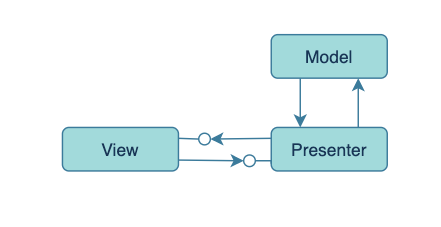
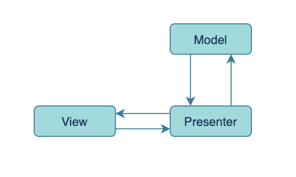
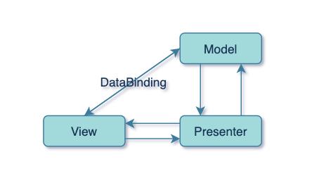

# MVP架构

在MVC一文中，我们提到了起源于Web的一种MVC架构变体，这套架构模式除了被广泛应用于Web后端（比如SpringMVC框架），也反哺了客户端架构的演化。

随着GUI框架的不断进化与完善，View层具备了独立的捕获交互事件以及处理交互事件的能力，捕获用户事件的操作从Controller转移到了View中，
这减轻了Controller的负担，使其可以专心的处理业务逻辑了。  
此外，还存在一个问题，那就是MVC中View层与Model层相耦合，View可以不经过Controller直接向Model请求数据，为了使Controller不那么可有可无，
人们便借鉴了Web中的MVC架构，View必须通过Controller向Model发起请求，Controller收到结果再去更新View，这样一来，View就只负责UI，无需处理业务逻辑。

在这套架构模式中，因为Controller不再作为系统与用户的连接，控制器这个名称似乎有些不合理，于是便改名为Presenter（主持人），
从名称也可以想到，这是一个协调View和Model工作的角色。

MVP架构模式解除了View与Model耦合，避免了业务逻辑出现View中，使在MVC中混乱的数据流/事件流变得清晰起来。
再后来，人们发现Presenter与View之间存在强耦合，这让两部分不好独立的进行开发与测试，便运用依赖倒置原则(DIP)提取出接口，让它们相互依赖接口。

## 角色划分

* **Model**：用来保存程序的数据状态，比如数据存储，网络请求等。
* **View**：GUI组件构成，向用户展示数据，响应用户事件等。
* **Presenter**：作为沟通View和Model的桥梁，处理来自View层转发的用户请求，从Model层检索数据，通知View层改变界面等。

## 两种常见的MVP

### Passive View

Passive View MVP是最典型的，在该架构模式中，View层是被动的，也就是说，View层本身不会主动改变自己的任何状态，所有状态都交由Presenter间接改变。

### Supervising Controller

Supervising Controller MVP与Passive View MVP的不同之处在于前者并没有完全解除View与Model之间的耦合，
而是使用DataBinding这类的框架将View属性与Model中部分数据进行绑定，简单的数据展示直接由View与Model进行同步，而
Presenter只处理复杂的状态同步与模块协调等工作。

## 解决的问题

1. 规范了传统MVC中混乱的数据流向/事件流向。
2. 将用户事件捕获从Controller(Presenter)中抽离出来，使Controller(Presenter)可以专注于业务逻辑。
3. 解除了View与Model之间的强耦合，使View层能更专注于UI处理。
4. 解除了View与Presenter之间的强耦合，使一个Presenter能够应用于多个View，同时各个模块可以独立开发、独立测试。

## 存在的问题

1. 会引入大量的接口，增加代码结构的复杂性（查看调用逻辑会很麻烦）。
2. Presenter层持有View，导致该层不得不感知View的声明周期，带来额外的复杂度。