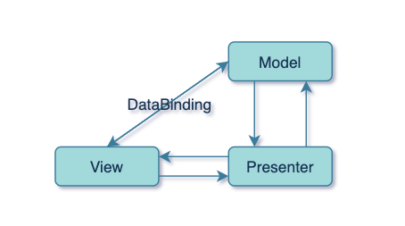

# MVVM架构

## 从Supervising Controller到Presentation Model

Supervising Controller MVP使用数据绑定直接将View与Model中部分属性进行绑定，在一定程度上减少了视图与模型之间同步的代码。
然而这种绑定只适用于简单属性-状态的同步，涉及到较为复杂视图状态同步便无能为力了；并且，在业务逻辑较为复杂时，直接将领域模型实体暴露给展示层，
可能会导致混合业务逻辑与表示逻辑的问题。

在2004年，Martin Flower提出了Presentation Model，该模式从视图层抽象出一个展示模型，
并命名为Presentation Model，视图则根据这个模型的实体进行渲染。  

Presentation Model将视图中的状态和行为放到一个单独的展示模型中，协调领域对象（模型），并为展示层提供接口，从而最大程度的减少在视图层中的逻辑。
视图层则将所有状态存储在展示模型中，并保持其状态与展示模型中的状态同步。

## MVVM

在JPresentation Model提出一年后，微软的John Gossman提出了MVVM用于构建WPF应用，而MVVM的思想理念与Presentation Model不谋而合，或者说，前者是后者的一个具体实现。  
在MVVM中，Model、View与MVC、MVP中的一致，ViewModel则是Presentation Model中的展示模型。

除了Model、View、ViewModel以外，微软之后还为MVVM引入了一个隐式的Binder层，通过Binder就可以用声明的方式将ViewModel中保存的状态数据与视图的状态相绑定，
从而实现展示模型与View自动更新。在Android中，这个Binder就是Google Jetpack中提供的DataBinding。

## 角色划分

* **Model**：用来保存程序的数据状态，比如数据存储，网络请求等。
* **View**：GUI组件构成，向用户展示数据，响应用户事件等。
* **ViewModel**：保持视图状态相关的数据，提供接口给View层调用以及和仓库层进行通信。
* **Binder(可选)**：以声明形式隐式的将ViewModel中的状态数据与View进行绑定。

## 解决的问题

1. 将视图的状态抽离出来，使视图的变化更加纯粹（可以类比纯函数），易于UI测试。
2. 领域模型到视图状态的转换逻辑转移到了ViewModel中，在彻底解除View与Model之间的耦合的同时，对复杂状态的同步也能很好的处理。
3. 声明式的绑定View状态，可以减少大量状态同步代码。

## 存在的问题

1. ViewState的抽离会产生更多类文件。
2. 对于简单界面简单状态同步会显得很麻烦。
3. Binder隐式绑定可能会导致debug困难。